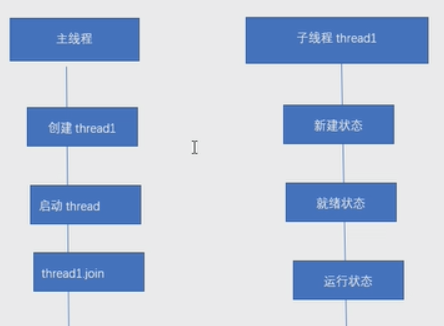

# 1. 如何保证多线程的多顺序性

## 通过`join()`保证顺序的特性

```java
 static Thread thread1 = new Thread(new Runnable() {
        @Override
        public void run() {
            System.out.println(Thread.currentThread().getName());
        }
    }, "thread1");
    static Thread thread2 = new Thread(new Runnable() {
        @Override
        public void run() {
            System.out.println(Thread.currentThread().getName());
        }
    }, "thread2");
    static Thread thread3 = new Thread(new Runnable() {
        @Override
        public void run() {
            System.out.println(Thread.currentThread().getName());
        }
    }, "thread3");

    public static void main(String[] args) throws InterruptedException {
        thread1.start();
        thread1.join();
        thread2.start();
        thread2.join();
        thread3.start();
        thread3.join();
    }
```

运行结果:

```
thread1
thread2
thread3
```

```java
public final void join() throws InterruptedException {
    join(0);
}
public final synchronized void join(long millis)
    throws InterruptedException {
    long base = System.currentTimeMillis();
    long now = 0;

    if (millis < 0) {
        throw new IllegalArgumentException("timeout value is negative");
    }

    if (millis == 0) { // 传入0
        while (isAlive()) { // 如果子线程还在运行，就等待，主线程进入休眠
            wait(0);
        }
    } else {
        while (isAlive()) {
            long delay = millis - now;
            if (delay <= 0) {
                break;
            }
            wait(delay);
            now = System.currentTimeMillis() - base;
        }
    }
}
```


让主线程等待子线程运行完成之后才能继续执行



## 用`ExecutorService`

JDK 1.5, 可以用`ExecutorService`,它采用的先入先出FIFO

```java
 static Thread thread1 = new Thread(new Runnable() {
        @Override
        public void run() {
            System.out.println(Thread.currentThread().getName());
        }
    }, "thread1");
    static Thread thread2 = new Thread(new Runnable() {
        @Override
        public void run() {
            System.out.println(Thread.currentThread().getName());
        }
    }, "thread2");
    static Thread thread3 = new Thread(new Runnable() {
        @Override
        public void run() {
            System.out.println(Thread.currentThread().getName());
        }
    }, "thread3");
    /**
     * FIFO
     */
    static ExecutorService executorService = Executors.newSingleThreadExecutor();

    public static void main(String[] args) {
        executorService.submit(thread1);
        executorService.submit(thread2);
        executorService.submit(thread3);
        executorService.shutdown();
    }
```