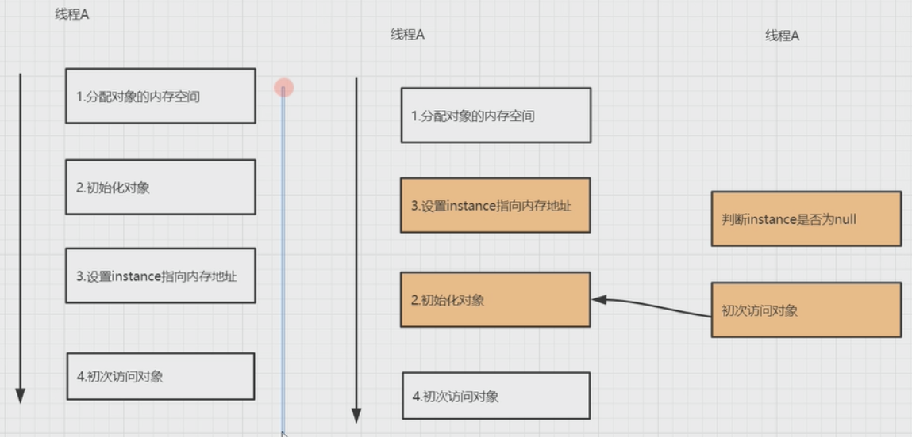

# 13. 指令重排序的问题

```java
public class VolatileDemo {
    private static volatile VolatileDemo instance; // 解决重排序

    public VolatileDemo getInstance() {
        if (null == instance) {
            synchronized (this) { // check double多线程访问
                if (null == instance) {
                    instance = new VolatileDemo();
                }
            }
        }
        return instance;
    }
}
```


