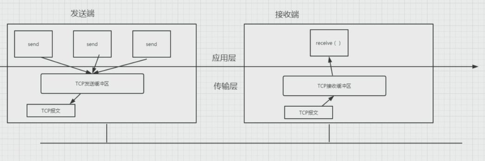

# 7. 阻塞IO和非阻塞IO

## 阻塞IO

BIO  blocking Input Output

用户态 	用户态Buffer

内核态　 内核态Buffer

必须等待缓冲区读走所有的，才能写

## 非阻塞IO

BIO

有监听事件，如果发现能写，则通知写入

解决socket与应用的解耦

事件机制，IO的多路复用

## 同步与异步

是针对请求操作来说的。

同步阻塞

同步非阻塞

异步阻塞

异步非阻塞

