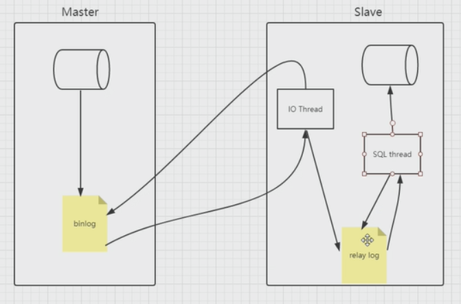

# 8.mysql binlog的底层原理

## 原理

记录mysql更新或潜在更新(delete from table where id=x)的二进制的日志文件

mysql的主从复制就是依赖binlog



## 模式

1. statement 基于SQL语句

2. row 基于行模式，如update table set field=xxx 记录10000条变更的数据

3. mixed 前两种的混合模式，由mysql自行判断

```mysql
show variables like '%log%';

| binlog_format                                  | ROW                                  |
| sync_binlog                                    | 1                                    |
```

`sync_binlog=1`表示事务提交后就同步到binlog

## 查看binlog的执行脚本

`mysqlbinlog --decode-output=base64-rows -v mysql-bin.000013`

查看已创建的表语句

`show create table company1\G;`

