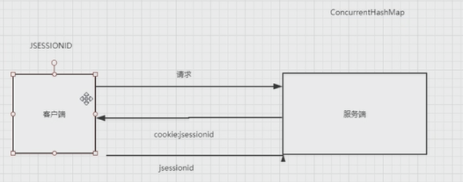

# 9.关于`cookie`与`session`的联系与区别

##  原理

由于http是无状态的，早期都是用session来存储用户登陆信息的。

`cookie`是存的客户端信息, 主要是key,values

包括 过期时间，路径，域 ，当浏览器关闭后，会话失效了。当用户重新打开时，已没有相应的sessionId了

`session`是存的是服务端信息，保存用户信息到session

## 分布式架构中几种方案

如复制session, Redis记录登陆信息，JWT方案

