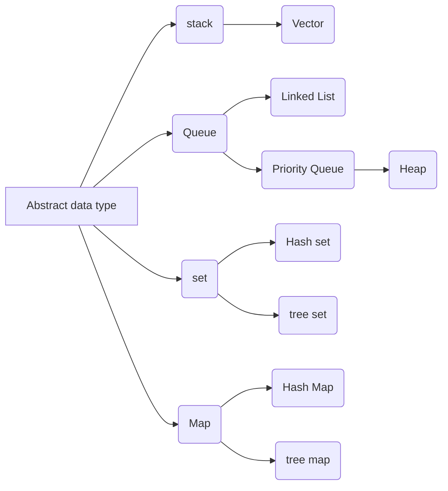

# 硅谷工作

留学F1

外企中国->美国总部L1

直接硅谷公司offer H-1B

# 精通一个领域

*  Chunk it up切碎知识点
* Deliberate practicing刻意练习
* Feedback反馈

##  Chunk it up切碎知识点

## Deliberate practicing刻意练习

## Feedback反馈

# 时间空间复杂度

## O(1)

## O(n)

## O(log(n))  & O(k^n) & O(n!)

第一种 O(n)

第二种O(1)

O(2^n)

## 面试知识点解析

练习题+练习方式

## Feedback

Solutions from LeetCode

Discussion Pannel in LeetCode

关键的关键

* 现在就动手
* 注册LeetCode
* 练习-坚持-机会给予有准备的人
* 每节课的课后作业

#  Array & Linked List

## Array

Acess: O(1)

insert: O(n)

delete: O(n)

## Linked List

插入new node

删除node

## Doubly linked list

时间复杂度

| operate | complex rate |
| ------- | ------------ |
| space   | O(n)         |
| prepend | O(1)         |
| append  | O(1)         |
| lookup  | O(n)         |
| insert  | O(1)         |
| delete  | O(1)         |

