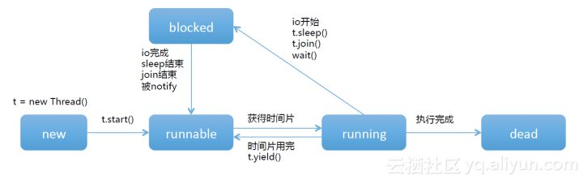

# 多线程技术
## 进程与线程

进程是具有一定独立功能的程序，关于某个数据集合上的一次运行活动，是系统进行资源分配和调度的一个独立单位。线程是进程的一个实体，是CPU分配调度的基本单位，代码的执行体。从概念上，我们可以知道进程是程序的一次运行活动，需要系统进行分配和调度的；线程是最终代码的执行体，是CPU分配调度的基本单位。同一个进程中可以包括多个线程，并且线程共享整个进程的资源，一个进程至少包括一个线程。

## 线程的生命周期



所谓的生命周期，指的是线程从出生到死亡过程中，经历的一系列状态。线程通过创建Thread的一个实例new Thread()进入new新建状态；之后调用start()方法进入等待被分配时间片，进入runnable状态；之后，线程获得CPU资源执行任务，进入running状态；当线程执行完毕或被其它线程杀死，线程就进入dead死亡状态；如果由于某种原因导致正在运行的线程让出CPU并暂停自己的执行，即进入blocked堵塞状态，在多种条件下，blocked状态可以恢复成runnable状态，最终在线程重新拿到时间片后，就可以进入running状态重新运行。在running状态下，如果时间片用完了或者线程主动放弃CPU的使用，线程重新回到runnable状态。

时间片指的是CPU的时间片段，CPU将它的可执行时间分成很多片段，每个片段随机分配给处在runnable状态下的线程，这样可以达到并发的效果。假设我有一个单核的CPU，通过分割很多的时间片，每个程序都有机会运行，仍然可以跑很多的程序，宏观上看是并发的，但是由于只有一个CPU，实际上程序还是串行的。

## 创建线程和线程池时要指定有意义的名称

### 线程名

```java
public static void main(String[] args) {
        // 订单模块
        Thread threadOne = new Thread(new Runnable()
        {
            @Override
            public void run()
            {
                System.out.println("保存订单的线程");
                throw new NullPointerException();
            }
        }, "订单模块");

        // 发货模块
        Thread threadTwo = new Thread(new Runnable()
        {
            @Override
            public void run()
            {
                System.out.println("保存收货地址的线程");
            }
        }, "发货模块");

        threadOne.start();
        threadTwo.start();
    }
```

创建线程时要指定有意义的名称，以便问题追溯

```shell
保存订单的线程
Exception in thread "订单模块" 保存收货地址的线程
java.lang.NullPointerException
	at ThreadWithName$1.run(ThreadWithName.java:16)
	at java.lang.Thread.run(Thread.java:748)
```

### 线程池名

一般一个应用中会创建不止一个线程池，为了业务隔离，一般不同的业务使用不同的线程池，同样不指定线程池名会很难难定位问题。

```java
public class ThreadPoolName {
    /**
     * 命名线程工厂
     * 默认线程池使用DefaultThreadFactory来创建线程和指定名称，所以可以定制线程工厂
     */
    static class NamedThreadFactory implements ThreadFactory {
        private static final AtomicInteger poolNumber = new AtomicInteger(1);
        private final ThreadGroup group;
        private final AtomicInteger threadNumber = new AtomicInteger(1);
        private final String namePrefix;

        NamedThreadFactory(String name) {

            SecurityManager s = System.getSecurityManager();
            group = (s != null) ? s.getThreadGroup() : Thread.currentThread().getThreadGroup();
            if (null == name || name.isEmpty()) {
                name = "pool";
            }

            namePrefix = name + "-" + poolNumber.getAndIncrement() + "-thread-";
        }

        @Override
        public Thread newThread(Runnable r) {
            Thread t = new Thread(group, r, namePrefix + threadNumber.getAndIncrement(), 0);
            if (t.isDaemon()) {
                t.setDaemon(false);
            }
            if (t.getPriority() != Thread.NORM_PRIORITY) {
                t.setPriority(Thread.NORM_PRIORITY);
            }
            return t;
        }
    }

    static ThreadPoolExecutor executorOne = new ThreadPoolExecutor(5, 5, 1, TimeUnit.MINUTES, new LinkedBlockingQueue<>(), new NamedThreadFactory("用户链接模块"));
    static ThreadPoolExecutor executorTwo = new ThreadPoolExecutor(5, 5, 1, TimeUnit.MINUTES, new LinkedBlockingQueue<>(), new NamedThreadFactory("用户请求模块"));

    public static void main(String[] args) {
        //接受用户链接模块
        executorOne.execute(new Runnable() {
            @Override
            public void run() {
                System.out.println("接受用户链接线程");
                throw new NullPointerException();
            }
        });

        //具体处理用户请求模块
        executorTwo.execute(new Runnable() {
            @Override
            public void run() {
                System.out.println("具体处理业务请求线程");
            }
        });

        executorOne.shutdown();
        executorTwo.shutdown();
    }
}
```

## 不要new线程，要用线程池

首先线程的创建和销毁是有系统开销的，线程是系统很宝贵的资源，如果无限制地创建会把系统资源消耗殆尽。

* 当执行大量异步任务时线程池能够复用线程，提供较好的性能，在不使用线程池的时候，每当需要执行异步任务时是直接new一线程进行运行，然后任务执行完毕后被销毁回收，而线程的创建和销毁是需要开销的。

* 线程池提供了一种资源限制和管理的手段，比如可以限制线程的个数、动态新增线程等，每个ThreadPoolExecutor也保留了一些基本的统计数据。

  * 其中getActiveCount返回当前激活的线程个数（正在执行任务的线程），

  * getCompletedTaskCount返回已经完成的任务个数，

  * getTaskCount返回所有任务个数，包含已经完成的、正在执行的和队列里面缓存的。

```java
public class ThreadWithoutPool {
    static class Demo
    {
        private int index;

        public void doTask()
        {
            System.out.println("i:" + index + " doTask() called");
        }

        public Demo(int index)
        {
            this.index = index;
        }
    }
    public static void main(String[] args) throws InterruptedException
    {
        for (int i = 0; i < 1000; ++i)
        {
            Demo demo = new Demo(i);
            Runnable runnable=()->demo.doTask();
            new Thread(runnable,"线程"+i).start();
        }
    }
}
```

使用线程池的时候，线程池里面的线程是可复用的，不会每次执行异步任务时都重新创建和销毁线程。

```java
public class ThreadWithPool {
    static class Demo {
        private int index;

        public void doTask() {
            System.out.println("i:" + index + " doTask() called");
            System.out.println("当前激活的线程个数（正在执行任务的线程）：" + threadPool.getActiveCount());
            System.out.println("已经完成的任务个数：" + threadPool.getCompletedTaskCount());
            System.out.println("所有任务个数，包含已经完成的、正在执行的和队列里面缓存的：" + threadPool.getTaskCount());
        }

        public Demo(int index) {
            this.index = index;
        }
    }

    static ThreadPoolExecutor threadPool = new ThreadPoolExecutor(8, 8, 1, TimeUnit.MINUTES, new LinkedBlockingQueue<Runnable>());

    public static void main(String[] args) {
        for (int i = 0; i < 1000; ++i) {
            Demo demo = new Demo(i);
            Runnable runnable = () -> demo.doTask();
            threadPool.execute(runnable);
        }
        threadPool.shutdown();
    }
}
```

## 程池不建议使用工具类Executors创建

不允许使用工具类Executors创建线程池，而是通过手动构造ThreadPoolExecutor来创建。

JDK提供Executors类的目的是为了便于开发人员创建线程池，通过Executors的下列方法可以创建不同用途的线程池。

### `newFixedThreadPool`

创建一个核心线程个数和最大线程个数都为nThreads的线程池，并且阻塞队列长度为 Integer.MAX_VALUE，keepAliveTime=0 说明只要线程个数比核心线程个数多并且当前空闲则回收。

```java
public static ExecutorService newFixedThreadPool(int nThreads)
{
    return new ThreadPoolExecutor(nThreads, nThreads, 0L, TimeUnit.MILLISECONDS, new LinkedBlockingQueue<Runnable>());
}

//使用自定义线程创建工厂
public static ExecutorService newFixedThreadPool(int nThreads, ThreadFactory threadFactory)
{
    return new ThreadPoolExecutor(nThreads, nThreads, 0L, TimeUnit.MILLISECONDS, new LinkedBlockingQueue<Runnable>(), threadFactory);
}
```

### `newSingleThreadExecutor`

创建一个核心线程个数和最大线程个数都为1的线程池，并且阻塞队列长度为 Integer.MAX_VALUE，keepAliveTime=0 说明只要线程个数比核心线程个数多并且当前空闲则回收。

```java
public static ExecutorService newSingleThreadExecutor()
{
    return new FinalizableDelegatedExecutorService(new ThreadPoolExecutor(1, 1, 0L, TimeUnit.MILLISECONDS, new LinkedBlockingQueue<Runnable>()));
}

//使用自己的线程工厂
public static ExecutorService newSingleThreadExecutor(ThreadFactory threadFactory)
{
    return new FinalizableDelegatedExecutorService(new ThreadPoolExecutor(1, 1, 0L, TimeUnit.MILLISECONDS, new LinkedBlockingQueue<Runnable>(), threadFactory));
}
```

### `newCachedThreadPool`

创建一个按需创建线程的线程池，初始线程个数为0，最多线程个数为 Integer.MAX_VALUE，并且阻塞队列为同步队列，keepAliveTime=60 说明只要当前线程60s内空闲则回收。这个的特殊性在于加入到同步队列的任务会马上被执行，同步队列里面最多只有一个任务。

```java
public static ExecutorService newCachedThreadPool()
{
    return new ThreadPoolExecutor(0, Integer.MAX_VALUE, 60L, TimeUnit.SECONDS, new SynchronousQueue<Runnable>());
}

//使用自定义的线程工厂
public static ExecutorService newCachedThreadPool(ThreadFactory threadFactory)
{
    return new ThreadPoolExecutor(0, Integer.MAX_VALUE, 60L, TimeUnit.SECONDS, new SynchronousQueue<Runnable>(), threadFactory);
}
```

> 使用Executors创建的线程池，屏蔽了太多细节，比如阻塞队列大小，默认是无界限，那么可能有些开发人员就不会注意到这个，从而导致阻塞队列堆积了大量元素，导致OOM。
>
> 《阿里巴巴Java开发手册》规定开发人员创建线程池时使用后者来创建，因为创建时需要开发人员清楚地指定线程池中核心线程个数、最大线程个数、非活跃线程生存周期、阻塞队列类型和拒绝策略。开发人员指定这些参数的时候必须根据具体场景设置最合适的参数，从而规避资源耗尽的风险。

## `SimpleDateFormat`是线程不安全的类

```java
public class TestSimpleDateFormat {
    //(1)创建单例实例
    static SimpleDateFormat sdf = new SimpleDateFormat("yyyy-MM-dd HH:mm:ss");

    public static void main(String[] args) {
        // (2)创建多个线程，并启动
        for (int i = 0; i < 10; ++i) {
            Runnable runnable = () -> {
                try {
                    // (3)使用单例日期实例解析文本
                    System.out.println(sdf.parse("2017-12-13 15:17:27"));
                } catch (Exception e) {
                    e.printStackTrace();
                }
            };
            // (4)启动线程
            new Thread(runnable).start();
        }
    }
}
```


  一个SimpleDateFormat实例，10个线程，每个线程都共用同一个sdf对象对文本日期进行解析，多运行几次就会抛出java.lang.NumberFormatException异常，加大线程的个数更容易复现。

Javadoc里面也有说明：

> Date formats are not synchronized. It is recommended to create separate format instances for each thread. If multiple threads access a format concurrently, it must be synchronized externally.

SimpleDateFormat是线程不安全的，其中存在共享变量，并且没有在访问共享变量前进行适当的同步处理。

如果一定要使用SimpleDateFormat，有以下方案:

* 定义工具类

    ```java
    public class TestSimpleDateFormatWithTool {
    //(1)创建单例实例
    static SimpleDateFormat getSimpleDateFormatInstance(String format) {
    return new SimpleDateFormat(format);
    }

    public static void main(String[] args) {
    // (2)创建多个线程，并启动
    for (int i = 0; i < 10; ++i) {
    Runnable runnable = () -> {
    try {
    SimpleDateFormat sdf = getSimpleDateFormatInstance("yyyy-MM-dd HH:mm:ss");
    // (3)使用单例日期实例解析文本
    System.out.println(sdf.parse("2017-12-13 15:17:27"));
    } catch (Exception e) {
    e.printStackTrace();
    }
    };
    // (4)启动线程
    new Thread(runnable).start();
    }
    }
    }
    ```

* 多线程中可以使用synchronized进行同步

  ```java
  public class TestSimpleDateFormatWithSync {
      //(1)创建单例实例
      static SimpleDateFormat sdf = new SimpleDateFormat("yyyy-MM-dd HH:mm:ss");
  
      public static void main(String[] args) {
          // (2)创建多个线程，并启动
          for (int i = 0; i < 10; ++i) {
              Runnable runnable = () -> {
                  try {
                      synchronized (sdf) {
                          // (3)使用单例日期实例解析文本
                          System.out.println(sdf.parse("2017-12-13 15:17:27"));
                      }
                  } catch (Exception e) {
                      e.printStackTrace();
                  }
              };
              // (4)启动线程
              new Thread(runnable).start();
          }
      }
  }
  ```

  使用同步意味着多个线程要竞争锁，在高并发场景下会导致系统响应性能下降。
  
  对于多线程环境，更推荐使用JodaTime进行处理。

## 高并发时考虑锁的性能损耗
高并发时，同步调用应考虑锁的性能，能用无锁，就不用锁，一定要用锁时候，加锁粒度尽量小。

在多线程编程中，少不了多个线程需要并发访问一个共享资源的情况，为避免多线程访问共享资源时的并发问题，一般需要在访问共享资源前进行适当同步，比如在处理共享资源前加独占锁，再处理资源，然后释放锁，但是锁的粒度使用不当，会影响并发性能。

一个共享变量，只有修改获取操作，并且共享变量的当前值并不依赖原来的值，这时候可以使用synchronized进行同步。

```java
public class SharedValue {
    private int val;

    public synchronized int getVal() {
        return val;
    }

    public synchronized void setVal(int val) {
        this.val = val;

    }
}
```

因为进入synchronized块前会清空锁块内本地内存中将会用到的共享变量，所以getVal方法获取的val是直接从主内存获取的，由于退出synchronized会把锁块内修改的本地变量刷新到主内存，从而保证了共享变量的内存可见性。

但是synchronized块加的是独占锁，这导致线程只能有一个线程获取锁调用getVal方法获取当前变量的值，而getVal本身并不会修改val的值，所以这大大降低了读取的并发性。

既然这里变量val的值并不依赖原来的值，那么这里其实使用无锁volatile修饰val变量就可以解决内存不可见性问题。

```java
public class SharedValue
{
    private volatile int val;

    public int getVal()
    {
        return val;
    }

    public void setVal(int val)
    {
        this.val = val;
    }
}
```

但是volatile只能保证内存可见性，不能保证原子性。

```java
public class UnSafeCount 
{
    private volatile int val;

    public int getVal() 
    {
        return val;
    }

    public void inc() 
    {
        ++val;
    }
}
```

  由于++val不具有原子性，所以该计数器不是线程安全的，应该保证inc方法是原子性的，这时候synchronized就派上用场了（synchronized保证原子性和内存可见性）。

```java
public class SafeCount 
{
    private int val;

    public synchronized int getVal() 
    {
        return val;
    }

    public synchronized void inc() 
    {
        ++val;
    }
}
```

但是由于synchronized是独占锁，导致同时调用getVal方法读取val值的线程竞争独占锁，这降低了并发度，这时候可以降低锁的范围，让读写锁分离。

```java
private final ReentrantReadWriteLock lock = new ReentrantReadWriteLock();
private final ReentrantReadWriteLock.WriteLock writeLock = lock.writeLock();
private final ReentrantReadWriteLock.ReadLock readLock = lock.readLock();
private int val;

public int getVal()
{
    readLock.lock();
    try
    {
        return val;
    }
    finally
    {
        readLock.unlock();
        
    }
}

public void inc()
{
    writeLock.lock();
    try
    {
        ++val;
    }
    finally
    {
        writeLock.unlock();
        
    }
}
```

使用读写分离锁，多个线程可以同时获取读锁然后获取val，增加了读取的并发度，但是上面的策略还是使用锁，其实关于计数器，JUC包提供了无锁CAS算法的实现，比如AtomicInteger、AtomicLong等类，如果在高并发下，大量线程在进行CAS失败后本地自旋重试，可以使用LongAdder。

## **并发修改同一条记录时需要加锁以避免更新丢失**

> 并发修改同一条记录时需要加锁以避免更新丢失。锁可以是应用层的，可以是缓存层，也可以是数据库层。

多线程并发修改同一个记录的情况在项目实践中很常见，为了避免数据更新丢失，一般有两种方式，一种是悲观锁，一种是乐观锁。

如果每次访问冲突概率小于20%，建议使用乐观锁，这是因为乐观锁本身不需要对行记录加锁，并发性能较好，另外使用乐观锁时重试次数不少于3次。如果每次访问冲突概率比较大，那么使用乐观锁会导致重试次数比较高，并且等达到重试次数后，也不一定更新OK，所以这时候建议使用悲观锁。

对于应用层，一般是使用分布式锁来做同步，缓存上可以使用Redis的CAS操作来做同步。

## 使用`ScheduledExecutorService`替代`Timer`

Timer下启动多个任务，只要其中一个任务抛出了异常，其他任务会自动终止，ScheduledExecutorService就不会有这个问题。

```java
public class TestTimer {
    // 创建定时器对象
    static Timer timer = new Timer();

    public static void main(String[] args) {
        // 添加任务1,延迟500ms执行
        timer.schedule(new TimerTask() {
            @Override
            public void run() {
                System.out.println("---one Task---");
                try {
                    Thread.sleep(1000);
                } catch (InterruptedException e) {
                    e.printStackTrace();
                }
                throw new RuntimeException("error ");
            }
        }, 500);

        // 添加任务2，延迟1000ms执行
        timer.schedule(new TimerTask() {
            @Override
            public void run() {
                for (; ; ) {
                    System.out.println("---two Task---");
                    try {
                        Thread.sleep(1000);
                    } catch (InterruptedException e) {
                        e.printStackTrace();
                    }
                }
            }
        }, 1000);
    }
}
```

实际执行结果，第一个任务抛异常后，第二个任务就终止了。

```shell
---one Task---
Exception in thread "Timer-0" java.lang.RuntimeException: error 
	at scheduler.TestTimer$1.run(TestTimer.java:27)
	at java.util.TimerThread.mainLoop(Timer.java:555)
	at java.util.TimerThread.run(Timer.java:505)
```

Timer内部当任务执行过程中抛出了除InterruptedException之外的异常后，唯一的消费线程就会因为抛出异常而终止，那么队列里面的其他待执行的任务就会被清除。

要实现类似Timer的功能使用ScheduledThreadPoolExecutor的schedule是比较好的选择。ScheduledThreadPoolExecutor中的一个任务抛出了异常，其他任务不受影响。

```java
public class TestSchedulerPool {
    static ScheduledThreadPoolExecutor scheduledThreadPoolExecutor = new ScheduledThreadPoolExecutor(1);

    public static void main(String[] args) {
        scheduledThreadPoolExecutor.schedule(new Runnable() {
            @Override
            public void run() {
                System.out.println("---one Task---");
                try {
                    Thread.sleep(1000);
                } catch (InterruptedException e) {
                    e.printStackTrace();
                }
                throw new RuntimeException("error ");
            }
        }, 500, TimeUnit.MICROSECONDS);

        scheduledThreadPoolExecutor.schedule(new Runnable() {
            @Override
            public void run() {
                for (int i = 0; i < 2; ++i) {
                    System.out.println("---two Task---");
                    try {
                        Thread.sleep(1000);
                    } catch (InterruptedException e) {
                        e.printStackTrace();
                    }
                }
            }
        }, 1000, TimeUnit.MICROSECONDS);

        scheduledThreadPoolExecutor.shutdown();
    }
}
```

执行结果符合预期

```
---one Task---
---two Task---
---two Task---

Process finished with exit code 0
```


## 线程协作

并行与协作：线程在并发的过程中更多的是协作关系，就像之前的概念中所提到的，进程是系统资源分配的单位，线程本身并没有多少分配资源，除了维护自己必须的内存开销之外，线程的所有资源都是在进程中。多线程在使用竞争中资源时，存在抢占或者说是共享的关系。

```java
public class TestTickets {
    public static void main(String[] args) {
        Tickets tickets = new Tickets();
        Thread thread1 = new Thread(tickets::sell, "sellA");
        Thread thread2 = new Thread(tickets::sell, "sellB");
        Thread thread3 = new Thread(tickets::sell, "sellC");
        thread1.start();
        thread2.start();
        thread3.start();
    }

    static class Tickets {
        int tickets = 10;

        void sell() {
            while (tickets > 0) {
                System.out.println(Thread.currentThread().getName() + " sell ticket: " + tickets);
                tickets--;
            }
            System.out.println(Thread.currentThread().getName() + " sell out: ");
        }
    }
}
```

一共有10张票，三个售票员sellerA，seller，sellerC一起去售票，sell( )方法模拟售票行为。代码启动线程之后，运行结果如下图所示。售票员sellerA在一个时间片内将sell方法中的代码全部跑完，票售空，但是sellerB与sellerC在线程并发时，也售出了第10张票，存在重复售票，这样的操作是不合理的。

```console
sellA sell ticket: 10
sellA sell ticket: 9
sellA sell ticket: 8
sellA sell ticket: 7
sellA sell ticket: 6
sellA sell ticket: 5
sellA sell ticket: 4
sellA sell ticket: 3
sellA sell ticket: 2
sellA sell ticket: 1
sellA sell out: 
sellB sell ticket: 10
sellB sell out: 
sellC sell ticket: 10
sellC sell out: 
```

为了解决重复售票的问题，我们可以使用Java中提供的同步关键字synchronized修饰sell( )方法，代码如下图所示。使用关键字synchronized修饰后，多线程在访问sell( )方法时，能保证只有一个线程执行这个方法，当前线程执行完sell( )方法后，其他线程才能执行sell( )方法。

```java
public class TestTickets2 {
    public static void main(String[] args) {
        Tickets tickets = new Tickets();
        Thread thread1 = new Thread(tickets::sell, "sellA");
        Thread thread2 = new Thread(tickets::sell, "sellB");
        Thread thread3 = new Thread(tickets::sell, "sellC");
        thread1.start();
        thread2.start();
        thread3.start();
    }

    static class Tickets {
        int tickets = 10;

        synchronized void sell() {
            while (tickets > 0) {
                System.out.println(Thread.currentThread().getName() + " sell ticket: " + tickets);
                tickets--;
            }
            System.out.println(Thread.currentThread().getName() + " sell out");
        }
    }
}
```

从下面结果可以看到，代码解决了重复售票的不合理问题，但是仍然只有sellerA一个在售票。原因在于，通过关键字synchronized修饰sell( )方法后，sellerA在拿到sell( )方法的执行权时，把里面的代码一口气执行完了，也就是将票全部卖出，等sellerA执行完后，sellerB和sellerC再执行sell( )方法时，票数已经为0，自然会出现下图中没有卖出一张票的现象。我们将方法sell( )中的内容叫做临界区，当一个线程进入临界区后，其他线程必须等待该线程执行完临界区内容后，才能进入该临界区。

```cmd
sellA sell ticket: 10
sellA sell ticket: 9
sellA sell ticket: 8
sellA sell ticket: 7
sellA sell ticket: 6
sellA sell ticket: 5
sellA sell ticket: 4
sellA sell ticket: 3
sellA sell ticket: 2
sellA sell ticket: 1
sellA sell out
sellB sell out
sellC sell out
```

下图所示的代码改善了上述sellerA一口气卖完所有票的现象。代码在方法体内使用关键字synchronized，括号中的this表示一个对象或者一个类。代码相较于上面的解决方法，将临界区从整个方法缩小到两行代码。也就是说多线程在执行这两行代码时是同步的。

```java
public class TestTickets3 {
    public static void main(String[] args) {
        Tickets tickets = new Tickets();
        Thread thread1 = new Thread(tickets::sell, "sellA");
        Thread thread2 = new Thread(tickets::sell, "sellB");
        Thread thread3 = new Thread(tickets::sell, "sellC");
        thread1.start();
        thread2.start();
        thread3.start();
    }

    static class Tickets {
        int tickets = 10;

         void sell() {
            while (tickets > 0) {
                synchronized (TestTickets.class) {
                    System.out.println(Thread.currentThread().getName() + " sell ticket: " + tickets);
                    tickets--;
                }
                // do something
                try {
                    TimeUnit.MILLISECONDS.sleep(5);
                } catch (InterruptedException e) {
                    e.printStackTrace();
                }
            }
            System.out.println(Thread.currentThread().getName() + " sell out");
        }
    }
}
```

从图中我们可以发现，不再是只有sellerA在卖票。并且代码每次执行结果都是不一样的，因为CPU的时间片是随机给出的。上述代码中的try catch方法块使线程睡50ms，延长售票操作的时间，在这段时间内可以执行其他的操作（比如，将该票给某个顾客）。代码改善过后，保证资源不是被独占的，使资源分配均匀。

```
sellA sell ticket: 10
sellB sell ticket: 9
sellC sell ticket: 8
sellB sell ticket: 7
sellA sell ticket: 6
sellC sell ticket: 5
sellC sell ticket: 4
sellB sell ticket: 3
sellA sell ticket: 2
sellB sell ticket: 1
sellC sell ticket: 0
sellA sell out
sellB sell out
sellC sell out
```

代码通过Lock接口定义了一个锁，使用ReentrantLock实现。锁和上面提到的关键字synchronized作用是一样的，都是定义出一个临界区，让线程进入临界区时实现线程同步。代码通过lock.lock( )定义临界区的初始点，使用在try语句块中定义临界区执行内容, finally语句块中采用unlock( )方法进行解锁。在unlock后线程才算真正走出临界区。使用try，finally的原因在于：如果try中抛出异常，如果没有finally中的解锁，线程不会调用unlock方法，永远占用这把锁，导致其他线程无法进入临界区执行代码。在finally中调用unlock( )方法保证无论什么情况下，锁终将被释放。避免死锁。

```java
public class TestTickets4 {
    public static void main(String[] args) {
        Tickets tickets = new Tickets();
        Thread thread1 = new Thread(tickets::sell, "sellA");
        Thread thread2 = new Thread(tickets::sell, "sellB");
        Thread thread3 = new Thread(tickets::sell, "sellC");
        thread1.start();
        thread2.start();
        thread3.start();
    }

    static class Tickets {
        private Lock lock= new ReentrantLock();
        int tickets = 10;

        void sell() {
            while (tickets > 0) {
               lock.lock();
               try{
                    //代码在临界区内加入判断条件，只有票数大于0时，才会进行售票操作，这是常用的双重检验方法。经过双重检验后，运行代码就不会出现无效售票。
                    if (tickets > 0) {
                        System.out.println(Thread.currentThread().getName() + " sell ticket: " + tickets);
                        tickets--;
                    }
                }finally {
                   lock.unlock();
               }
                // do something
                try {
                    TimeUnit.MILLISECONDS.sleep(5);
                } catch (InterruptedException e) {
                    e.printStackTrace();
                }
            }
            System.out.println(Thread.currentThread().getName() + " sell out");
        }
    }
}
```

## 线程池

线程虽然不占用进程中的资源，但在Java中，如果每当一个请求到达就创建一个新线程，开销是相当大的。并且，如果在一个JVM里创建太多的线程，可能会导致系统由于过度消耗内存导致系统资源不足，为了防止资源不足，应该尽可能减少创建和销毁线程的次数，特别是一些资源耗费比较大的线程的创建和销毁，尽量复用已有对象来进行服务，这就线程池技术产生的原因。如果想要实现线程的复用，我们需要继承线程，在run方法中通过循环不断从外部获取runnable的实现，以此达到线程复用的目的。有了复用后，可以提供线程池，管理线程，线程池可以控制线程的并发度，同时，通过对多个任务重用线程，线程创建的开销就被分摊到了多个任务上了，而且由于在请求到达时线程已经存在，所以消除了线程创建所带来的延迟。

ThreadPoolExecutor的构造方法，下面介绍一下方法中包含的参数:

- corePoolSize：表示线程池的核心线程数，指线程池中常驻线程的数量，核心线程数会一直在线程池中存活，除非线程池停止使用被资源回收了。
- maximumPoolSize：指线程池所能容纳的最大线程数量，当活动线程数到达这个数值后，后续的新任务将会被阻塞。
- keepAliveTime：非核心线程闲置时的超时时长，超过这个时长，非核心线程就会被回收。当ThreadPoolExecutor的allowCoreThreadTimeOut属性设置为true时，keepAliveTime同样会作用于核心线程。
- Unit：用于指定keepAliveTime参数的时间单位。
- workQueue：表示线程池中的任务队列（阻塞队列），通过线程池的execute方法提交Runnable对象会存储在这个队列中。
- threadFactory：表示线程工厂，为线程池提供创建新线程的功能。
- RejectExecutionHandler：这个参数表示当ThreadPoolExecutor已经关闭或者已经饱和时（达到了最大线程池大小而且工作队列已经满），提供以下几个策略考虑是否拒绝到达的任务。DiscardPolicy：直接忽略提交的任务
- AbortPolicy：忽略提交的任务，在拒绝的同时抛出异常，通知调用者拒绝执行
- CallerRunsPolicy：让线程池的使用者所在的线程运行提交的任务调用者
- DiscardOlderestPolicy：忽略最早放到队列中的任务

下图代码中自定义了一个线程池。通过线程池的submit( )方法提交runnable的实现，最终通过线程池的shutdown( )方法关闭线程池。

```java
public class ThreadPool {
    public static void main(String[] args) {
        ThreadPoolExecutor threadPoolExecutor = new ThreadPoolExecutor(16, 30,
                30L, TimeUnit.MILLISECONDS,
                new ArrayBlockingQueue<Runnable>(10), new ThreadFactory() {
            @Override
            public Thread newThread(Runnable r) {
                Thread t = new Thread(r);
                t.setDaemon(false);
                t.setUncaughtExceptionHandler((thread, e) -> System.out.println(e.getMessage()));
                return t;
            }
        }, new ThreadPoolExecutor.DiscardOldestPolicy());
        threadPoolExecutor.submit(()->System.out.println(Thread.currentThread().getName()));
        threadPoolExecutor.shutdown();
        findJavaExecutorsBug();
    }

    /**
     * Java包中预置的线程池有以下几种：
     * newSingleThreadExecutor；
     * newFixedThreadPool：
     * newCachedThreadPool：
     * newScheduledThreadPool：
     * 但在阿里巴巴的Java开发中是不建议甚至禁止使用Java预置线程池的。
     * 代码利用循环，无限添加runnable的实现，
     但是由于单一线程的阻塞队列是没有边界的，会导致添加的对象过多，耗尽内存资源。
     * 因此阿里巴巴开发手册是明确禁止使用Java预置线程池的。
     */
    private static void findJavaExecutorsBug() {
        ExecutorService executorService = Executors.newSingleThreadExecutor();
        for (; ; ) {
            executorService.submit(() -> {
                try {
                    TimeUnit.MILLISECONDS.sleep(30L);
                } catch (InterruptedException e) {
                    e.printStackTrace();
                }
            });
        }
    }
}
```

测试定义vm options

`-Xmx1024m -Xms1024m -Xmn512m -XX:MetaspaceSize=512m`

 初始堆内存与最大堆内存大小设为一致，这样虚拟机一次性的分配内存，而不至于在初始堆大小不够用又向系统分配内存

```
Thread-0
Exception in thread "main" java.lang.OutOfMemoryError: GC overhead limit exceeded
	at java.util.concurrent.AbstractExecutorService.newTaskFor(AbstractExecutorService.java:87)
	at java.util.concurrent.AbstractExecutorService.submit(AbstractExecutorService.java:111)
	at java.util.concurrent.Executors$DelegatedExecutorService.submit(Executors.java:678)
	at ThreadPool.findJavaExecutorsBug(ThreadPool.java:46)
	at ThreadPool.main(ThreadPool.java:30)

```

